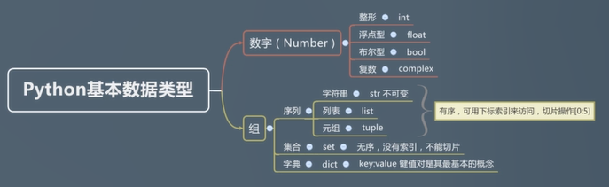

# 全面系统 Python3.8 入门+进阶

〖课程介绍〗:
无论是大数据、人工智能还是机器学习，Python 都是最热门的首选语言 ，这次课程，就将带你从基础入门 Python3，掌握 Python3.x 版本语法，并结合讲师实际工作经验讲解 Python 使用技巧以及数据结构等相关知识，并为你精心配套了练习题目及实战案例。

## 第 1 章 Python 入门导学

介绍 Python 的特性、优点、缺点、前景以及课程的内容、重点和特色。

1-1 导学 试看

1-2 Python 的特性

1-3 我为什么喜欢 Python

1-4 Python 的缺点

1-5 一个经典误区

### 1-6 python 能做些什么？

1. 爬虫
2. 大数据与数据分析（Spark）
3. 自动化运维与自动化测试
4. .Web 开发：Flask、Django
5. 机器学习：Tensor Flow
6. 胶水语言：混合其他如 C++、Java 等来编程。能够把用其他语言制作的各种模块（尤其是 C/C++）很轻松地联结在一起

1-7 课程内容与特点

1-8 Python 的前景

1-9 课程维护与提问。

1-10 2020.2 更新说明

## 第 2 章 Python 环境安装

一键安装 Python 的编译环境，写出第一段 Python 代码

2-1 如何有效提问（文章推荐）

2-2 Python 学习建议（重要）

2-3 Python 版本选择说明

2-4 Python 多版本问题

2-5 Python Mac 版本问题指南（选看）

### 2-6 下载 Python 安装包

### 2-7 安装 Python

#### [python 虚拟环境管理工具 venv 教程](https://vra.github.io/2021/01/03/venv-intro/)

> ##### 0. 概述
>
> Python 有各种各样的系统包和第三方开发的包，让我们的开发变得异常容易。不过也引入了一个问题，不同代码需要的包版本可能是不一样的，所以常常回出现这种情况，为了代码 B 修改了依赖包的版本，代码 B 能 work 了，之前使用的代码 A 就没法正常工作了。因此常常需要对不同的代码设置不同的 Python 虚拟环境。[venv](https://docs.python.org/zh-cn/3/tutorial/venv.html)是 Python 自带的虚拟环境管理工具，使用很方便，这里简单记录一下使用方法。
>
> 需要注意的是，venv 工具没法创建不同版本的 python 环境，也就是如果你用 python3.5 没法创建 python3.6 的虚拟环境。如果想要使用不同 python 版本的虚拟环境，请安装 virtual env 包。
>
> ##### 1. 安装
>
> python3.6 及以上已经默认安装，python3.5 需要通过系统的包管理工具安装：
>
> ```
> sudo apt install python3-venv
> ```
>
> ##### 2. 创建虚拟环境
>
> 在`~/test_env`目录下创建虚拟环境：
>
> ```
> python3 -m venv test_env
> ```
>
> ##### 3. 启用虚拟环境
>
> ```
> source ~/test_env/bin/activate
> ```
>
> 可以看到，命令行的提示符前面会出现括号，里面是虚拟环境名称。
>
> 使用`pip`安装需要的包：
>
> ```
> pip install tensorflow
> ```
>
> 注意这里不需要 root 权限，因此无需添加`sudo`。
>
> 安装的包会放在`~/test_env/lib/pythonx.x/site-packages` 目录下。
>
> ##### 4. 退出虚拟环境
>
> 退出虚拟的 python 环境，在命令行执行下面的命令即可：
>
> ```
> deactivate
> ```

### 2-8 IDLE 与第一段 Python 代码

```python
print("hello world")
```

## 第 3 章 理解什么是写代码与 Python 的基本类型

本章详细介绍了 Python 的基本类型，包括整形、浮点型；10、8、2、16 进制数的意义和转换关系；布尔类型；字符串与字符串常见运算操作

3-1 什么是代码，什么是写代码 试看

### 3-2 数字：整形与浮点型

```
print(type(1))
print(type(-1))
print(type(1.1))
print(type(1.1111111111111111111111111111))
print(type(1 + 0.1))
print(type(1.0 + 1))
print(type(1.0 * 1))
print(type(1 / 1))  # <class 'float'>
print(type(1 // 1))  # <class 'int'>
print(1 // 2)  # 0
print(1 / 2)  # 0.5
```

3-3 10、2、8、16 进制

### 3-4 各进制的表示与转换

```
# 二进制
print(0b11)  # 3
# 八进制
print(0o11)  # 9
# 十六进制
print(0x1f)  # 31

# 进制转换
# 转换为二进制
print(bin(0x1f))  # 0b11111
# 转换为八进制
print(oct(0x1f))  # 0o37
# 转换为十进制
print(int(0x1f))  # 31
# 转换为十六进制
print(hex(0b11111))  # 0x1f
```

### 3-5 数字：布尔类型与复数

```
# boolean
print(type(True))
print(type(False))
print(int(True))  # 1
print(int(False))  # 0
print(bool(1))  # True
print(bool(0))  # False
print(bool(1.1))  # True
print(bool(-1.1))  # True
print(bool(0b01))  # True
print(bool(0b00))  # False
print(bool(''))  # False
print(bool('a'))  # True
print(bool([1, 2]))  # True
print(bool([]))  # False
print(bool({1, 2, 3}))  # True
print(bool({}))  # False
print(bool(None))  # False
# 复数
print(360432j)  # False
```

### 3-6 字符串：单引号、双引号、三引号

如何表示字符串？
单引号，双引号，三引号

```
print("1")
print('1')
print(1)

print(type("1"))  # <class 'str'>
print(type('1'))  # <class 'str'>
print(type(1))  # <class 'int'>

print('let\'s go')
print("let's go")

print('''let's go 1,
1,
1''')

print("""let's go 2,
2,
2""")

# 使用反斜杠n换行
print("""let's go 3, \n3, \n3""")

print("let's go 4, \n4, \n4")

# 使用三引号换行，多两个回车
print("""
let's go 5,
5,
5
""")

# 使用反斜杠换行输入，实际并没有换行
# let's go 6, 6, 6
print("\
let's go 6, \
6, \
6\
")

```

3-7 多行字符串

### 3-8 转义字符

特殊的字符，无法“看见”的字符，与语言本身语法有冲突的字符

```
\n 换行
\` 单引号
\t 横向制表符
\r 回车
```

```
# 转义字符
print('1\n1')
print('2\`2')
print('3\t3')
print('4\r4')
print('hello \n world')
print('hello \\n world')  # hello \n world
```

### 3-9 原始字符串

```
# 示例字符串
print('c:\north\north')
print('c:\\north\\north')
# 打印原始字符串
print(r'c:\north\north')

```

### 3-10 字符串运算

```
print('hello'+"world")
print('hello'*2)
print('hello'[4])
print('hello'[0])
print("hello world"[6])
print("hello world"[-5])

# 截取字符串 多数一位
print("hello world"[0:5])  # hello
print("hello world"[0:-1])  # hello worl

# 截取world 冒号前面默认0，后面默认最后一位位置
print("hello world"[6:11])  # world
print("hello world"[6:])  # world
print("hello world"[-5:])  # world

```

3-11 字符串运算 二

3-12 字符串运算 三

后面笔记在代码里面

## 第 4 章 Python 中表示“组”的概念与定义

本章详细讲解了“组”的概念，以及在 Python 中用来表示“组”的一些类型，包括：元组、列表、集合和字典。

### 4-1 列表的定义

### 4-2 列表的基本操作

### 4-3 元组

### 4-4 序列总结

### 4-5 set 集合

### 4-6 dict 字典

### 4-7 思维导图总结基本数据类型



## 第 5 章 变量与运算符

本章详细讲解变量的意义与七种运算符，并对每一种运算符的扩展做出详细的讲解

### 5-1 什么是变量

### 5-2 变量的命名规则

### 5-3 值类型与引用类型

### 5-4 列表的可变与元组的不可变

### 5-5 运算符号

### 5-6 赋值运算符

没有自增 自减

### 5-7 比较运算符

### 5-8 不只是数字才能做比较运算\_

### 5-9 逻辑运算符

### 5-10 成员运算符

### 5-11 身份运算符

### 5-12 如何判断变量的值、身份与类型

### 5-13 位运算符

## 第 6 章 分支、循环、条件与枚举

本章是代码的基本逻辑结构，包括条件控制（if else）、循环控制（for in 、while）、表达式与运算符的优先级。此外，我们还将在这一章讲解 Python 的枚举类型。此外，我们还将对 Python 编码的规范做出讲解。

### 6-1 什么是表达式

### 6-2 表达式的优先级

### 6-3 表达式优先级练习

### 6-4 在文本文件中编写 Python 代码

### 6-5 熟悉 VSCode 开发环境与 Python 插件安装

### 6-6 Python Linter 安装出现错误解决方案（新增）

### 6-7 lint 语法检测问题（新增）

### 6-8 流程控制语句之条件控制一

### 6-9 流程控制语句之条件控制 二

### 6-10 常量与 Pylint 的规范

### 6-11 流程控制语句之条件控制 三 snippet、嵌套分支、代码块的概念

### 6-12 流程控制语句之条件控制 四 elif 的优点

### 6-13 思考题解答与改变定势思维

## 第 7 章 包、模块、函数与变量作用域

本章对 Python 代码的组织结构核心：包、模块与函数分别作出讲解。学习完本章后你将对 Python 代码的组织结构有一个非常清晰的认识。重点是函数，我们除了讲解函数的基本概念外，还将讲解 Python 灵活的函数参数机制（默认参数、关键字参数与列表参数）。...

### 7-1 while 循环与使用场景

### 7-2 for 与 for-else 循环

### 7-3 for 与 range

### 7-4 新篇章导言

### 7-5 Python 工程的组织结构：包、模块儿、类

### 7-6 Python 包与模块的名字

### 7-7 import 导入模块

### 7-8 from import 导入变量

### 7-9 **init**.py 的用法

### 7-10 包与模块的几个常见错误\_

### 7-11 模块内置变量

### 7-12 入口文件和普通模块内置变量的区别

### 7-13 **name**的经典应用

### 7-14 相对导入和绝对导入 一

### 7-15 相对导入和绝对导入 二

## 第 8 章 Python 函数

函数是所有语言中都具备的基本代码组织结构。函数的重要性不言而喻。而对于 Python 来说，函数的用法及其灵活，远比其他语言要强大很多。本章节讲详细讲述 Python 函数的定义、调用、序列解包、必须参数、关键字参数、默认参数等诸多内容。...

### 8-1 认识函数

### 8-2 函数的定义及运行特点

### 8-3 如何让函数返回多个结果

### 8-4 序列解包与链式赋值

### 8-5 必须参数与关键字参数

### 8-6 默认参数

### 8-7 可变参数

### 8-8 关键字可变参数

### 8-9 变量作用域

### 8-10 作用域链

### 8-11 global 关键字

### 8-12 划算还是不划算

## 第 9 章 高级部分：面向对象

本章讲详细讲解面向对象的概念。包括面向对象的三大特性（继承、封装、多态）、类的基本构成元素、python 的内置类属性、方法重写、运算符重载、静态方法等

### 9-1 类的定义

### 9-2 浅谈函数与方法的区别

### 9-3 类与对象。

### 9-4 构造函数

### 9-5 区别模块变量与类中的变量

### 9-6 类变量与实例变量

### 9-7 类与对象的变量查找顺序

### 9-8 self 与实例方法

### 9-9 在实例方法中访问实例变量与类变量

### 9-10 类方法

### 9-11 静态方法

### 9-12 成员可见性：公开和私有

### 9-13 没有什么是不能访问

### 9-14 继承.

### 9-15 子类方法调用父类方法：super 关键字

## 第 10 章 正则表达式与 JSON

此章节是原生爬虫的基础。正则表达式也是文本解析中非常重要的知识点。本章我们将讲解什如何在 Python 中编写正则表达式与常见的正则表达式。此外，JSON 作为非常重要的数据格式，我们会重点讲解，包括 JSON 对象，JSON 字符串，Python 类型与 JSON 的转换。...

### 10-1 初识正则表达式

### 10-2 元字符与普通字符

### 10-3 字符集

### 10-4 概括字符集

### 10-5 数量词

### 10-6 贪婪与非贪婪

### 10-7 匹配 0 次 1 次或者无限多次

### 10-8 边界匹配符

### 10-9 组

### 10-10 匹配模式参数

### 10-11 re.sub 正则替换

### 10-12 把函数作为参数传递

### 10-13 search 与 match 函数

### 10-14 group 分组

### 10-15 一些关于学习正则的建议

### 10-16 理解 JSON

### 10-17 反序列化

### 10-18 序列化

### 10-19 小谈 JSON、JSON 对象与 JSON 字符串

## 第 11 章 Python 的高级语法与用法

本章节我们揭开 Python 进阶部分的高级特性，详细讲解枚举、闭包，并对函数式编程做出介绍

### 11-1 枚举其实是一个类

### 11-2 枚举和普通类相比有什么优势

### 11-3 枚举类型、枚举名称与枚举值

### 11-4 枚举的比较运算

### 11-5 枚举注意事项

### 11-6 枚举转换

### 11-7 枚举小结

### 11-8 进阶内容开场白

### 11-9 一切皆对象

### 11-10 什么是闭包

### 11-11 一个事例看看闭包

### 11-12 闭包的经典误区

### 11-13 出个题,用闭包解决!

### 11-14 我先用非闭包解决一下

### 11-15 再用闭包解决一下\_

### 11-16 小谈函数式编程

## 第 12 章 函数式编程： 匿名函数、高阶函数、装饰器

本章节进一步介绍函数式编程的 lambda、mapeduce、filter 以及装饰器

### 12-1 lambda 表达式。

### 12-2 三元表达式

### 12-3 map

### 12-4 map 与 lambda

### 12-5 reduce

### 12-6 filter

### 12-7 命令式编程 vs 函数式编程

### 12-8 装饰器 一

### 12-9 装饰器 二

### 12-10 装饰器 三

### 12-11 装饰器 四

### 12-12 装饰器 五

### 12-13 装饰器 六

## 第 13 章 实战：原生爬虫

本章我们将学习如何访问网络数据、获取与解析网络数据、爬虫的基本原理解释。并带领大家实现一个用最基础语法不使用爬虫框架的原生爬虫项目。

### 13-1 案例代码调整说明

### 13-2 分析抓取目的确定抓取页面

### 13-3 整理爬虫常规思路

### 13-4 VSCode 中调试代码

### 13-5 HTML 结构分析基本原则二条

### 13-6 数据提取层级分析及原则三

### 13-7 正则分析 HTML

### 13-8 正则分析获取名字和人数

### 13-9 数据精炼

### 13-10 sorted 排序

### 13-11 更换网站代码调整与讲解（必看）

### 13-12 案例总结

## 第 14 章 Pythonic 与 Python 杂记

本章我们将大量扩展 Python 的优秀写法，学会如何写出优质的 Pythonic 风格的代码。包括：如何让字典保持有序、lmbda 表达式的应用等高级 Python 知识

### 14-1 导言

### 14-2 用字典映射代替 switch case 语句

### 14-3 列表推导式

### 14-4 字典如何编写列表推导式

### 14-5 iterator 与 generator

### 14-6 None

### 14-7 对象存在并不一定是 True

### 14-8 **len**与**bool**内置方法

### 14-9 装饰器的副作用

### 14-10 当我们谈编程能力的时候，我们谈的是什么（选自 Java 全栈体系课程小节）

### 14-11 py3.8 新增海象运算符

### 14-12 f 关键字做字符串拼接

### 14-13 py3.7 新增数据类 dataclass 装饰器

## 第 15 章 进阶教程《Python Flask 高级编程》多章节试看体验 1

为让同学们选择更适合进阶提升的教程，特申请了《Python Flask 高级编程（下篇）》课程多篇章内容试看，让同学们充分了解新课程再购买。虽然是试看，但我也希望同学们能够从试看中学到知识。我尽可能保证试看章节的完整性，但很难保证绝对的完整，望大家理解。...

### 15-1 鱼书是一个什么样的产品

### 15-2 准备工作

### 15-3 使用官方推荐的 pipenv 创建虚拟环境（很好用哦~）\_x264

### 15-4 开发工具推荐

### 15-5 设置开发工具的默认解释器

### 15-6 flask 最小原型与唯一 URL 原则

### 15-7 路由的另一种注册方法

### 15-8 app.run 相关参数与 flask 配置文件

### 15-9 你并没有真正理解 if **name**的作用

### 15-10 响应对象：Response

## 第 16 章 进阶教程《Python Flask 高级编程》多章节试看体验 2

为让同学们选择更适合进阶提升的教程，特申请了《Python Flask 高级编程（下篇）》课程多篇章内容试看，让同学们充分了解新课程再购买。虽然是试看，但我也希望同学们能够从试看中学到知识。我尽可能保证试看章节的完整性，但很难保证绝对的完整，望大家理解。...

试看，不完整

### 16-1 鱼豆

### 16-2 思维逻辑锻炼.

### 16-3 事务与回滚.

### 16-4 Python @contextmanager_x264

### 16-5 灵活使用@contextmanager_x264

### 16-6 结合继承、yield、contextmanager、rollback 来解决问题

### 16-7 类变量的陷阱.
